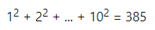
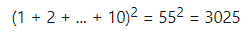

# [Project Euler](https://projecteuler.net/archives)

> ## About Project Euler
>
> ### Where should I start?
>
> That depends on your background. There are two tables containing problems. The [Recent](https://projecteuler.net/recent) problems table lists the ten most recently published problems, so if you are new to Project Euler then you may prefer to start with the [Archives](https://projecteuler.net/archives) to get a feel for the different types/difficulties of our problems. The first one-hundred or so problems are generally considered to be easier than the problems which follow. In the archives table you will be able to see how many people have solved each problem; as a general rule of thumb the more people that have solved it, the easier it is. To assist further there is a difficulty rating system which may also help you decide where to start. You are able to sort the problems in the archives table on ID, Solved By, or Difficulty.
>
> ### I've written my program but should it take days to get to the answer?
>
> Absolutely not! Each problem has been designed according to a "one-minute rule", which means that although it may take several hours to design a successful algorithm with more difficult problems, an efficient implementation will allow a solution to be obtained on a modestly powered computer in less than one minute.
>
> ### Does it matter if it takes more than one minute to solve?
>
> Of course not, but that should provide the impetus to return to the problem and see how you can improve your approach. But remember that once you've solved a particular problem you will be able to access a thread relating to that problem and it is here that you may be able to pick some tips from others that have solved it.
>
> ### I solved it by using a search engine, does that matter?
>
> Making use of the internet to research a problem is to be encouraged as there could be hidden treasures of mathematics to be discovered beneath the surface of many of these problems. However, there is a fine line between researching ideas and using the answer you found on another website. If you photocopy a crossword solution then what have you achieved?
>
> ### I've checked my program ten times now and I keep getting told my answer is wrong! Have you made a mistake?
>
> With newly released problems it is quite possible that a small error may have slipped through the net, or maybe the wording is slightly ambiguous and the problem has not been explained as well as it could. However, when so many people have hit the target and one marksman misses ten times on the run, he/she can hardly shoot his/her own foot and conclude that because the gun is working properly the fault must lie in the target.
>
> ### Do you have any hints on solving problems?
>
> Read the details of the problem very carefully and make note of any example cases given. Experiment with pencil and paper to get a feel for the ideas behind the problem. If the ideas are new to you, use the internet or books to get some background; the problem should contain clues as to what to look-up. Try writing a program to generate for simple cases and check that your output agrees with the example cases; this will confirm you've understood the problem and are heading in the right direction. Based on this try to extrapolate to estimate the time it will take to get the final answer and if it's going to take significantly more than a minute rethink your strategy.
>
> ### What are the levels and awards all about?
>
> For every twenty-five problems you solve you will advance one level, which should help encourage you to make short term targets. The awards are earned for a variety of reasons and if you are wondering what you need to do to earn an award go to the [Statistics](https://projecteuler.net/statistics) page and you can see a complete list of current awards. In the case of both levels and awards you can click on the image on the Statistics page to see which members are currently at that level or who has earned a particular award. It is hoped that the levels and awards will provide a bit of extra fun as you solve the problems.
>
> ### There seems to be discussion threads for each problem, so why can't I access some of them?
>
> You are only able to access a thread for a particular problem once you have solved it. Once you have access you will be able to see how other members have solved the problem, discuss methods, and share your insights.
>
> ## 关于欧拉项目
>
> ### 我应该从哪里开始？
>
> 这取决于你的背景。有两个不同顺序的解题步骤。 [Recent](https://projecteuler.net/recent) 问题表列出了最近发布的十个问题，因此如果您是`Project Euler`的新手，那么您可能更愿意从 [Archives](https://projecteuler.net/archives) 开始了解我们问题的不同类型/困难。通常认为第一百个问题比后面的问题容易。在档案表中，您将能够看到有多少人解决了每个问题;作为一般的经验法则，解决它的人越多，就越容易。为了进一步提供帮助，有一个难度评级系统，它也可以帮助您决定从哪里开始。您可以在存档表中 ID，Solved By 或 Difficulty 中的问题进行排序。
>
> ### 我已经编写了我的程序但是需要几天才能得到答案吗？
>
> 绝对不！每个问题都是根据“一分钟规则”设计的，这意味着虽然设计一个成功的算法可能需要几个小时才能解决更多难题，但是有效的实施将允许在一个适度的计算机上获得解决方案。不到一分钟。
>
> ### 如果解决时间超过一分钟是否重要
>
> 当然不是，但这应该提供回到问题的动力，看看如何改进你的方法。但请记住，一旦你解决了一个特定的问题，你将能够访问与该问题相关的线程，在这里你可以从其他已经解决它的问题中挑选一些技巧。
>
> ### 我通过使用搜索引擎解决了它，这有关系吗？
>
> 利用互联网来研究一个问题是值得鼓励的，因为在许多这些问题的表面下可能会发现隐藏的数学宝藏。但是，在研究想法和使用您在其他网站上找到的答案之间存在一条界限。如果您复印填字游戏解决方案，那么您取得了什么成果？
>
> ### 我现在检查了我的程序十次，我不断被告知我的答案是错的！你弄错了吗？
>
> 对于新发布的问题，很可能一个小错误可能已经通过网络丢失，或者措辞可能有些模糊，并且问题没有得到解释。然而，很多人都做过这个题目并未发现错误的时候，很有可能是你错了。
>
> ### 你对解决问题有任何暗示吗？
>
> 仔细阅读问题的详细信息，并记下给出的任何示例案例。用铅笔和纸试验，以了解问题背后的想法。如果这些想法对您来说是新的，请使用互联网或书籍来获得一些背景;问题应该包含查找内容的线索。尝试编写程序来生成简单的案例，并检查您的输出是否与示例案例一致;这将证实你已经理解了这个问题，正朝着正确的方向前进。在此基础上尝试推断以估计获得最终答案所需的时间，以及是否需要花费超过一分钟的时间重新考虑您的策略。
>
> ### 所有级别和奖项是什么？
>
> 对于您解决的每25个问题，您将提升一个级别，这应该有助于鼓励您制定短期目标。奖项是出于各种原因而获得的，如果您想知道获得奖项需要做些什么，请访问 [Statistic](https://projecteuler.net/statistics) 页面，您可以看到完整的当前列表奖项。在级别和奖励的情况下，您可以单击“统计”页面上的图像，以查看当前处于该级别的成员或获得特定奖励的人员。希望在您解决问题时，级别和奖励将提供一些额外的乐趣。
>
> ### 似乎每个问题都有讨论线程，为什么我不能访问其中的一些呢？
>
> 需要在正确解答通过之后才能参与。

## [1.Multiples of 3 and 5](https://projecteuler.net/problem=1)

If we list all the natural numbers below 10 that are multiples of 3 or 5, we get 3, 5, 6 and 9. The sum of these multiples is 23.

Find the sum of all the multiples of 3 or 5 below 1000.

如果我们列出10以下的所有自然数是3或5的倍数，我们得到3,5,6和9.这些倍数的总和是23。

求出1000以下3或5的所有倍数的总和。

## [2.Even Fibonacci numbers](https://projecteuler.net/problem=2)

Each new term in the Fibonacci sequence is generated by adding the previous two terms. By starting with 1 and 2, the first 10 terms will be:

1, 2, 3, 5, 8, 13, 21, 34, 55, 89, ...

By considering the terms in the Fibonacci sequence whose values do not exceed four million, find the sum of the even-valued terms.

Fibonacci 序列中的每个新值都是通过前两个值累加生成的。 从1和2开始，前10个值将是：

1,2,3,5,8,13,21,34,55,89 ......

通过考虑 Fibonacci 序列中的值不超过4,000,000的项，找到偶数项的总和。

## [3.Largest prime factor](https://projecteuler.net/problem=3)

The prime factors of 13195 are 5, 7, 13 and 29.

What is the largest prime factor of the number 600851475143 ?

13195 的素数因子是 5,7,13 和 29。

600851475143 的最大素数因子是多少？

## [[Add]  Collatz conjecture](https://zh.wikipedia.org/wiki/%E8%80%83%E6%8B%89%E5%85%B9%E7%8C%9C%E6%83%B3)

考拉兹函数定义如下
$$
f(x)=\left\{
\begin{array}{**lr**}
3n+1&x为奇数且x\neq1\\
n/2&x为偶数\\
1&x=1
\end{array}
\right.
$$
通过对 $x$ 取不同的值，发现最后都会收敛到 1。求该函数构成算法的上下界。

## [4.Largest palindrome product](https://projecteuler.net/problem=4)

A palindromic number reads the same both ways. The largest palindrome made from the product of two 2-digit numbers is 9009 = 91 × 99.

Find the largest palindrome made from the product of two 3-digit numbers.

回文数字可以从两个方向阅读但是大小不变。 由两个2位数字的乘积制成的最大回文是9009 = 91×99。

找到由两个3位数字的乘积制成的最大回文数字。

[palindromic number](https://zh.wikipedia.org/wiki/%E5%9B%9E%E6%96%87%E6%95%B0)

> **回文数**(或**回文数**)是指一个像14641这样“对称”的[数](https://zh.wikipedia.org/wiki/%E6%95%B0_(%E6%95%B0%E5%AD%A6))，即：将这个数的[数字](https://zh.wikipedia.org/wiki/%E6%95%B0%E5%AD%97)按相反的顺序重新排列后，所得到的数和原来的数一样。这里，“[回文](https://zh.wikipedia.org/wiki/%E5%9B%9E%E6%96%87)”是指像“妈妈爱我，我爱妈妈”这样的，正读反读都相同的单词或句子。

> 回文数在[休闲数学](https://zh.wikipedia.org/w/index.php?title=%E4%BC%91%E9%97%B2%E6%95%B0%E5%AD%A6&action=edit&redlink=1)领域备受关注。一个典型的问题就是，寻找那些具有某种特性，并且符合回文特征的数。例如：
>
> - [回文素数](https://zh.wikipedia.org/wiki/%E5%9B%9E%E6%96%87%E7%B4%A0%E6%95%B0)：2, 3, 5, 7, 11, 101, 131, 151,… [A002385](https://oeis.org/A002385)
> - 回文[完全平方](https://zh.wikipedia.org/wiki/%E5%AE%8C%E5%85%A8%E5%B9%B3%E6%96%B9)数：0, 1, 4, 9, 121, 484, 676, 10201, 12321,… [A002779](https://oeis.org/A002779)
>
> [巴克敏斯特·福乐](https://zh.wikipedia.org/wiki/%E5%B7%B4%E5%85%8B%E6%95%8F%E6%96%AF%E7%89%B9%C2%B7%E5%AF%8C%E5%8B%92)在其著作《[协同学](https://zh.wikipedia.org/wiki/%E5%8D%8F%E5%90%8C%E5%AD%A6)》（*Synergetics*）中把回文数也叫做**沙拉扎数**（Scheherazade Numbers），沙拉扎是《[一千零一夜](https://zh.wikipedia.org/wiki/%E4%B8%80%E5%8D%83%E9%9B%B6%E4%B8%80%E5%A4%9C)》中那位讲故事的王妃、即宰相的女儿的名字。
>
> 直观地，在任意的[进位制](https://zh.wikipedia.org/wiki/%E9%80%B2%E4%BD%8D%E5%88%B6)下都存在着[无穷多](https://zh.wikipedia.org/wiki/%E6%97%A0%E9%99%90%E9%9B%86%E5%90%88)个回文数。可以这样说明：在任意的基下，一个像101, 1001, 10001,… （即由一个1后接*n*个0再后接一个1）这样的数可组成一个无穷多项的[序列](https://zh.wikipedia.org/wiki/%E5%BA%8F%E5%88%97)，其各项全部都是回文数，因此这个基下的回文数有无穷多个（其中包括但不限于该序列中的无穷多个项）。

## [5.Smallest multiple](https://projecteuler.net/problem=5)

2520 is the smallest number that can be divided by each of the numbers from 1 to 10 without any remainder.

What is the smallest positive number that is evenly divisible by all of the numbers from 1 to 20?

2520 可以整除 1 到 10 中的每个数字。

可以被 1 到 20 的所有数字整除的最小正数是多少？

其实也就是求最小公倍数。

## [[Add]Highest common factor](https://zh.wikipedia.org/wiki/%E6%9C%80%E5%A4%A7%E5%85%AC%E5%9B%A0%E6%95%B8)

> **最大公因数**（英语：highest common factor，hcf）也称**最大公约数**（英语：greatest common divisor，gcd）是[数学](https://zh.wikipedia.org/wiki/%E6%95%B8%E5%AD%B8)词汇，指能够[整除](https://zh.wikipedia.org/wiki/%E6%95%B4%E9%99%A4)多个[整数](https://zh.wikipedia.org/wiki/%E6%95%B4%E6%95%B8)的最大正整数。而多个整数不能都为零。例如 8 和 12 的最大公因数为 4。
>
> 整数序列的最大公因数可以记为或。
>
> 求两个整数最大公约数主要的方法：
>
> - [穷举法](https://zh.wikipedia.org/wiki/%E7%AA%AE%E8%88%89%E6%B3%95)：分别列出两整数的所有约数，并找出最大的公约数。
> - [素因数分解](https://zh.wikipedia.org/wiki/%E8%B3%AA%E5%9B%A0%E6%95%B8%E5%88%86%E8%A7%A3)：分别列出两数的素因数分解式，并计算共同项的[乘积](https://zh.wikipedia.org/wiki/%E4%B9%98%E7%A7%AF)。
> - [短除法](https://zh.wikipedia.org/wiki/%E7%9F%AD%E9%99%A4%E6%B3%95)：两数除以其共同[素因数](https://zh.wikipedia.org/wiki/%E8%B3%AA%E5%9B%A0%E6%95%B8)，直到两数[互素](https://zh.wikipedia.org/wiki/%E4%BA%92%E8%B3%AA)时，所有除数的乘积即为最大公约数。
> - [辗转相除法](https://zh.wikipedia.org/wiki/%E8%BC%BE%E8%BD%89%E7%9B%B8%E9%99%A4%E6%B3%95)：两数相除，取余数重复进行相除，直到余数为时，前一个除数即为最大公约数。
>
> 最小公倍数可以通过多种方法得到，最直接的方法是列举法，从小到大列举出其中一个数（如最大数）的倍数，当这个倍数也是另一个数的倍数时，就求得最小公倍数。另一个方法是利用公式来求解，这时首先要知道它们的最大公因数。而最大公因数可以通过[短除法](https://zh.wikipedia.org/wiki/%E7%9F%AD%E9%99%A4%E6%B3%95)得到。
>
> 利用整数的[唯一分解定理](https://zh.wikipedia.org/wiki/%E7%AE%97%E6%9C%AF%E5%9F%BA%E6%9C%AC%E5%AE%9A%E7%90%86)，还可以用[质因数分解](https://zh.wikipedia.org/wiki/%E8%B3%AA%E5%9B%A0%E6%95%B8%E5%88%86%E8%A7%A3)法。将每个整数进行质因数分解。对每个质数，在质因数分解的表达式中寻找次数最高的乘幂，最后将所有这些质数乘幂相乘就可以得到最小公倍数。譬如求**216**、**384**和**210**的最小公倍数。对**216**、**384**和**210**来说：

## [[Add]least common multiple](https://zh.wikipedia.org/wiki/%E6%9C%80%E5%B0%8F%E5%85%AC%E5%80%8D%E6%95%B8)

> **最小公倍数**是[数论](https://zh.wikipedia.org/wiki/%E6%95%B0%E8%AE%BA)中的一个概念。若有一个数，可以被另外两个数、}整除，且大于（或等于）和，则为和的公倍数。和的公倍数有无限个，而所有的公倍数中，最小的公倍数就叫做最小公倍数。两个[整数](https://zh.wikipedia.org/wiki/%E6%95%B4%E6%95%B8)公有的倍数称为它们的**公倍数**，其中最小的一个[正整数](https://zh.wikipedia.org/wiki/%E6%AD%A3%E6%95%B4%E6%95%B0)称为它们两个的最小公倍数。同样地，若干个整数公有的倍数中最小的正整数称为它们的最小公倍数。整数![[a_1, a_2, \cdots , a_n]](https://wikimedia.org/api/rest_v1/media/math/render/svg/c04066d337f0d82ae8d415aa318b7f5697ec86ae)，或者参照英文记法记作，其中**lcm**是英语中“最小公倍数”一词（*least common multiple*）的首字母缩写。
>
> 对[分数](https://zh.wikipedia.org/wiki/%E5%88%86%E6%95%B8)进行加减运算时，要求两数的分母相同才能计算，故需要通分；标准的计算步骤是将两个分数的分母通分成它们的最小公倍数，然后将通分后的分子相加。

## [6.Sum square difference](https://projecteuler.net/problem=6)

The sum of the squares of the first ten natural numbers is,

The square of the sum of the first ten natural numbers is,

Hence the difference between the sum of the squares of the first ten natural numbers and the square of the sum is 3025 − 385 = 2640.

Find the difference between the sum of the squares of the first one hundred natural numbers and the square of the sum.

前 10 个自然数的平方和为，

这些数的和的平方为，

因此平方和和和的平方之差为 3025 - 385 = 2640。

求前 100 个自然数的和平方和平方和的差。