# [Project Euler](https://projecteuler.net/archives)

算法的意义是干掉所有的重复计算。

——沃·兹基硕德

> ## About Project Euler
>
> ### Where should I start?
>
> That depends on your background. There are two tables containing problems. The [Recent](https://projecteuler.net/recent) problems table lists the ten most recently published problems, so if you are new to Project Euler then you may prefer to start with the [Archives](https://projecteuler.net/archives) to get a feel for the different types/difficulties of our problems. The first one-hundred or so problems are generally considered to be easier than the problems which follow. In the archives table you will be able to see how many people have solved each problem; as a general rule of thumb the more people that have solved it, the easier it is. To assist further there is a difficulty rating system which may also help you decide where to start. You are able to sort the problems in the archives table on ID, Solved By, or Difficulty.
>
> ### I've written my program but should it take days to get to the answer?
>
> Absolutely not! Each problem has been designed according to a "one-minute rule", which means that although it may take several hours to design a successful algorithm with more difficult problems, an efficient implementation will allow a solution to be obtained on a modestly powered computer in less than one minute.
>
> ### Does it matter if it takes more than one minute to solve?
>
> Of course not, but that should provide the impetus to return to the problem and see how you can improve your approach. But remember that once you've solved a particular problem you will be able to access a thread relating to that problem and it is here that you may be able to pick some tips from others that have solved it.
>
> ### I solved it by using a search engine, does that matter?
>
> Making use of the internet to research a problem is to be encouraged as there could be hidden treasures of mathematics to be discovered beneath the surface of many of these problems. However, there is a fine line between researching ideas and using the answer you found on another website. If you photocopy a crossword solution then what have you achieved?
>
> ### I've checked my program ten times now and I keep getting told my answer is wrong! Have you made a mistake?
>
> With newly released problems it is quite possible that a small error may have slipped through the net, or maybe the wording is slightly ambiguous and the problem has not been explained as well as it could. However, when so many people have hit the target and one marksman misses ten times on the run, he/she can hardly shoot his/her own foot and conclude that because the gun is working properly the fault must lie in the target.
>
> ### Do you have any hints on solving problems?
>
> Read the details of the problem very carefully and make note of any example cases given. Experiment with pencil and paper to get a feel for the ideas behind the problem. If the ideas are new to you, use the internet or books to get some background; the problem should contain clues as to what to look-up. Try writing a program to generate for simple cases and check that your output agrees with the example cases; this will confirm you've understood the problem and are heading in the right direction. Based on this try to extrapolate to estimate the time it will take to get the final answer and if it's going to take significantly more than a minute rethink your strategy.
>
> ### What are the levels and awards all about?
>
> For every twenty-five problems you solve you will advance one level, which should help encourage you to make short term targets. The awards are earned for a variety of reasons and if you are wondering what you need to do to earn an award go to the [Statistics](https://projecteuler.net/statistics) page and you can see a complete list of current awards. In the case of both levels and awards you can click on the image on the Statistics page to see which members are currently at that level or who has earned a particular award. It is hoped that the levels and awards will provide a bit of extra fun as you solve the problems.
>
> ### There seems to be discussion threads for each problem, so why can't I access some of them?
>
> You are only able to access a thread for a particular problem once you have solved it. Once you have access you will be able to see how other members have solved the problem, discuss methods, and share your insights.
>
> ## 关于欧拉项目
>
> ### 我应该从哪里开始？
>
> 这取决于你的背景。有两个不同顺序的解题步骤。 [Recent](https://projecteuler.net/recent) 问题表列出了最近发布的十个问题，因此如果您是`Project Euler`的新手，那么您可能更愿意从 [Archives](https://projecteuler.net/archives) 开始了解我们问题的不同类型/困难。通常认为第一百个问题比后面的问题容易。在档案表中，您将能够看到有多少人解决了每个问题;作为一般的经验法则，解决它的人越多，就越容易。为了进一步提供帮助，有一个难度评级系统，它也可以帮助您决定从哪里开始。您可以在存档表中 ID，Solved By 或 Difficulty 中的问题进行排序。
>
> ### 我已经编写了我的程序但是需要几天才能得到答案吗？
>
> 绝对不！每个问题都是根据“一分钟规则”设计的，这意味着虽然设计一个成功的算法可能需要几个小时才能解决更多难题，但是有效的实施将允许在一个适度的计算机上获得解决方案。不到一分钟。
>
> ### 如果解决时间超过一分钟是否重要
>
> 当然不是，但这应该提供回到问题的动力，看看如何改进你的方法。但请记住，一旦你解决了一个特定的问题，你将能够访问与该问题相关的线程，在这里你可以从其他已经解决它的问题中挑选一些技巧。
>
> ### 我通过使用搜索引擎解决了它，这有关系吗？
>
> 利用互联网来研究一个问题是值得鼓励的，因为在许多这些问题的表面下可能会发现隐藏的数学宝藏。但是，在研究想法和使用您在其他网站上找到的答案之间存在一条界限。如果您复印填字游戏解决方案，那么您取得了什么成果？
>
> ### 我现在检查了我的程序十次，我不断被告知我的答案是错的！你弄错了吗？
>
> 对于新发布的问题，很可能一个小错误可能已经通过网络丢失，或者措辞可能有些模糊，并且问题没有得到解释。然而，很多人都做过这个题目并未发现错误的时候，很有可能是你错了。
>
> ### 你对解决问题有任何暗示吗？
>
> 仔细阅读问题的详细信息，并记下给出的任何示例案例。用铅笔和纸试验，以了解问题背后的想法。如果这些想法对您来说是新的，请使用互联网或书籍来获得一些背景;问题应该包含查找内容的线索。尝试编写程序来生成简单的案例，并检查您的输出是否与示例案例一致;这将证实你已经理解了这个问题，正朝着正确的方向前进。在此基础上尝试推断以估计获得最终答案所需的时间，以及是否需要花费超过一分钟的时间重新考虑您的策略。
>
> ### 所有级别和奖项是什么？
>
> 对于您解决的每25个问题，您将提升一个级别，这应该有助于鼓励您制定短期目标。奖项是出于各种原因而获得的，如果您想知道获得奖项需要做些什么，请访问 [Statistic](https://projecteuler.net/statistics) 页面，您可以看到完整的当前列表奖项。在级别和奖励的情况下，您可以单击“统计”页面上的图像，以查看当前处于该级别的成员或获得特定奖励的人员。希望在您解决问题时，级别和奖励将提供一些额外的乐趣。
>
> ### 似乎每个问题都有讨论线程，为什么我不能访问其中的一些呢？
>
> 需要在正确解答通过之后才能参与。

## [1.Multiples of 3 and 5](https://projecteuler.net/problem=1)

If we list all the natural numbers below 10 that are multiples of 3 or 5, we get 3, 5, 6 and 9. The sum of these multiples is 23.

Find the sum of all the multiples of 3 or 5 below 1000.

如果我们列出10以下的所有自然数是3或5的倍数，我们得到3,5,6和9.这些倍数的总和是23。

求出1000以下3或5的所有倍数的总和。

## [2.Even Fibonacci numbers](https://projecteuler.net/problem=2)

Each new term in the Fibonacci sequence is generated by adding the previous two terms. By starting with 1 and 2, the first 10 terms will be:

1, 2, 3, 5, 8, 13, 21, 34, 55, 89, ...

By considering the terms in the Fibonacci sequence whose values do not exceed four million, find the sum of the even-valued terms.

Fibonacci 序列中的每个新值都是通过前两个值累加生成的。 从1和2开始，前10个值将是：

1,2,3,5,8,13,21,34,55,89 ......

通过考虑 Fibonacci 序列中的值不超过4,000,000的项，找到偶数项的总和。

## [3.Largest prime factor](https://projecteuler.net/problem=3)

The prime factors of 13195 are 5, 7, 13 and 29.

What is the largest prime factor of the number 600851475143 ?

13195 的素数因子是 5,7,13 和 29。

600851475143 的最大素数因子是多少？

## [[Add]  Collatz conjecture](https://zh.wikipedia.org/wiki/%E8%80%83%E6%8B%89%E5%85%B9%E7%8C%9C%E6%83%B3)

考拉兹函数定义如下
$$
f(x)=\left\{
\begin{array}{**lr**}
3n+1&x为奇数且x\neq1\\
n/2&x为偶数\\
1&x=1
\end{array}
\right.
$$
通过对 $x$ 取不同的值，发现最后都会收敛到 1。求该函数构成算法的上下界。

## [4.Largest palindrome product](https://projecteuler.net/problem=4)

A palindromic number reads the same both ways. The largest palindrome made from the product of two 2-digit numbers is 9009 = 91 × 99.

Find the largest palindrome made from the product of two 3-digit numbers.

回文数字可以从两个方向阅读但是大小不变。 由两个2位数字的乘积制成的最大回文是9009 = 91×99。

找到由两个3位数字的乘积制成的最大回文数字。

[palindromic number](https://zh.wikipedia.org/wiki/%E5%9B%9E%E6%96%87%E6%95%B0)

> **回文数**(或**回文数**)是指一个像14641这样“对称”的[数](https://zh.wikipedia.org/wiki/%E6%95%B0_(%E6%95%B0%E5%AD%A6))，即：将这个数的[数字](https://zh.wikipedia.org/wiki/%E6%95%B0%E5%AD%97)按相反的顺序重新排列后，所得到的数和原来的数一样。这里，“[回文](https://zh.wikipedia.org/wiki/%E5%9B%9E%E6%96%87)”是指像“妈妈爱我，我爱妈妈”这样的，正读反读都相同的单词或句子。

> 回文数在[休闲数学](https://zh.wikipedia.org/w/index.php?title=%E4%BC%91%E9%97%B2%E6%95%B0%E5%AD%A6&action=edit&redlink=1)领域备受关注。一个典型的问题就是，寻找那些具有某种特性，并且符合回文特征的数。例如：
>
> - [回文素数](https://zh.wikipedia.org/wiki/%E5%9B%9E%E6%96%87%E7%B4%A0%E6%95%B0)：2, 3, 5, 7, 11, 101, 131, 151,…[](https://zh.wikipedia.org/wiki/OEIS) [A002385](https://oeis.org/A002385)
> - 回文[完全平方](https://zh.wikipedia.org/wiki/%E5%AE%8C%E5%85%A8%E5%B9%B3%E6%96%B9)数：0, 1, 4, 9, 121, 484, 676, 10201, 12321,…[](https://zh.wikipedia.org/wiki/OEIS) [A002779](https://oeis.org/A002779)
>
> [巴克敏斯特·福乐](https://zh.wikipedia.org/wiki/%E5%B7%B4%E5%85%8B%E6%95%8F%E6%96%AF%E7%89%B9%C2%B7%E5%AF%8C%E5%8B%92)在其著作《[协同学](https://zh.wikipedia.org/wiki/%E5%8D%8F%E5%90%8C%E5%AD%A6)》（*Synergetics*）中把回文数也叫做**沙拉扎数**（Scheherazade Numbers），沙拉扎是《[一千零一夜](https://zh.wikipedia.org/wiki/%E4%B8%80%E5%8D%83%E9%9B%B6%E4%B8%80%E5%A4%9C)》中那位讲故事的王妃、即宰相的女儿的名字。
>
> 直观地，在任意的[进位制](https://zh.wikipedia.org/wiki/%E9%80%B2%E4%BD%8D%E5%88%B6)下都存在着[无穷多](https://zh.wikipedia.org/wiki/%E6%97%A0%E9%99%90%E9%9B%86%E5%90%88)个回文数。可以这样说明：在任意的基下，一个像101, 1001, 10001,… （即由一个1后接*n*个0再后接一个1）这样的数可组成一个无穷多项的[序列](https://zh.wikipedia.org/wiki/%E5%BA%8F%E5%88%97)，其各项全部都是回文数，因此这个基下的回文数有无穷多个（其中包括但不限于该序列中的无穷多个项）。

## [5.Smallest multiple](https://projecteuler.net/problem=5)

2520 is the smallest number that can be divided by each of the numbers from 1 to 10 without any remainder.

What is the smallest positive number that is evenly divisible by all of the numbers from 1 to 20?

2520 可以整除 1 到 10 中的每个数字。

可以被 1 到 20 的所有数字整除的最小正数是多少？

其实也就是求最小公倍数。

## [[Add]Highest common factor](https://zh.wikipedia.org/wiki/%E6%9C%80%E5%A4%A7%E5%85%AC%E5%9B%A0%E6%95%B8)

> **最大公因数**（英语：highest common factor，hcf）也称**最大公约数**（英语：greatest common divisor，gcd）是[数学](https://zh.wikipedia.org/wiki/%E6%95%B8%E5%AD%B8)词汇，指能够[整除](https://zh.wikipedia.org/wiki/%E6%95%B4%E9%99%A4)多个[整数](https://zh.wikipedia.org/wiki/%E6%95%B4%E6%95%B8)的最大正整数。而多个整数不能都为零。例如 8 和 12 的最大公因数为 4。
>
> 整数序列的最大公因数可以记为或。
>
> 求两个整数最大公约数主要的方法：
>
> - [穷举法](https://zh.wikipedia.org/wiki/%E7%AA%AE%E8%88%89%E6%B3%95)：分别列出两整数的所有约数，并找出最大的公约数。
> - [素因数分解](https://zh.wikipedia.org/wiki/%E8%B3%AA%E5%9B%A0%E6%95%B8%E5%88%86%E8%A7%A3)：分别列出两数的素因数分解式，并计算共同项的[乘积](https://zh.wikipedia.org/wiki/%E4%B9%98%E7%A7%AF)。
> - [短除法](https://zh.wikipedia.org/wiki/%E7%9F%AD%E9%99%A4%E6%B3%95)：两数除以其共同[素因数](https://zh.wikipedia.org/wiki/%E8%B3%AA%E5%9B%A0%E6%95%B8)，直到两数[互素](https://zh.wikipedia.org/wiki/%E4%BA%92%E8%B3%AA)时，所有除数的乘积即为最大公约数。
> - [辗转相除法](https://zh.wikipedia.org/wiki/%E8%BC%BE%E8%BD%89%E7%9B%B8%E9%99%A4%E6%B3%95)：两数相除，取余数重复进行相除，直到余数为时，前一个除数即为最大公约数。
>
> 最小公倍数可以通过多种方法得到，最直接的方法是列举法，从小到大列举出其中一个数（如最大数）的倍数，当这个倍数也是另一个数的倍数时，就求得最小公倍数。另一个方法是利用公式来求解，这时首先要知道它们的最大公因数。而最大公因数可以通过[短除法](https://zh.wikipedia.org/wiki/%E7%9F%AD%E9%99%A4%E6%B3%95)得到。
>
> 利用整数的[唯一分解定理](https://zh.wikipedia.org/wiki/%E7%AE%97%E6%9C%AF%E5%9F%BA%E6%9C%AC%E5%AE%9A%E7%90%86)，还可以用[质因数分解](https://zh.wikipedia.org/wiki/%E8%B3%AA%E5%9B%A0%E6%95%B8%E5%88%86%E8%A7%A3)法。将每个整数进行质因数分解。对每个质数，在质因数分解的表达式中寻找次数最高的乘幂，最后将所有这些质数乘幂相乘就可以得到最小公倍数。譬如求**216**、**384**和**210**的最小公倍数。对**216**、**384**和**210**来说：

## [[Add]least common multiple](https://zh.wikipedia.org/wiki/%E6%9C%80%E5%B0%8F%E5%85%AC%E5%80%8D%E6%95%B8)

> **最小公倍数**是[数论](https://zh.wikipedia.org/wiki/%E6%95%B0%E8%AE%BA)中的一个概念。若有一个数，可以被另外两个数、整除，且大于（或等于）和，则为和的公倍数。和的公倍数有无限个，而所有的公倍数中，最小的公倍数就叫做最小公倍数。两个[整数](https://zh.wikipedia.org/wiki/%E6%95%B4%E6%95%B8)公有的倍数称为它们的**公倍数**，其中最小的一个[正整数](https://zh.wikipedia.org/wiki/%E6%AD%A3%E6%95%B4%E6%95%B0)称为它们两个的最小公倍数。同样地，若干个整数公有的倍数中最小的正整数称为它们的最小公倍数。整数![[a_1, a_2, \cdots , a_n]](https://wikimedia.org/api/rest_v1/media/math/render/svg/c04066d337f0d82ae8d415aa318b7f5697ec86ae)，或者参照英文记法记作，其中**lcm**是英语中“最小公倍数”一词（*least common multiple*）的首字母缩写。
>
> 对[分数](https://zh.wikipedia.org/wiki/%E5%88%86%E6%95%B8)进行加减运算时，要求两数的分母相同才能计算，故需要通分；标准的计算步骤是将两个分数的分母通分成它们的最小公倍数，然后将通分后的分子相加。

## [6.Sum square difference](https://projecteuler.net/problem=6)

The sum of the squares of the first ten natural numbers is,


The square of the sum of the first ten natural numbers is,


Hence the difference between the sum of the squares of the first ten natural numbers and the square of the sum is 3025 − 385 = 2640.

Find the difference between the sum of the squares of the first one hundred natural numbers and the square of the sum.

前 10 个自然数的平方和为，


这些数的和的平方为，


因此平方和和和的平方之差为 3025 - 385 = 2640。

求前 100 个自然数的和平方和平方和的差。

## [7.10001st prime](https://projecteuler.net/problem=7)

By listing the first six prime numbers: 2, 3, 5, 7, 11, and 13, we can see that the 6th prime is 13.

What is the 10 001st prime number?

通过列举前 6 个素数：2，3，5，7，11，13我们可以发现 13 是第 6 个素数

那么第 10001 个素数是多少。

> ***Problem 7***
> ***Find the 10001st prime***
>
> 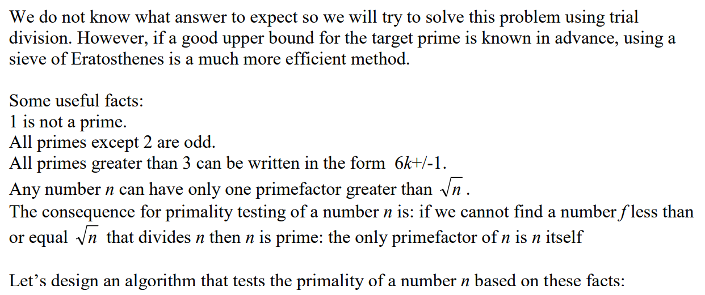

> 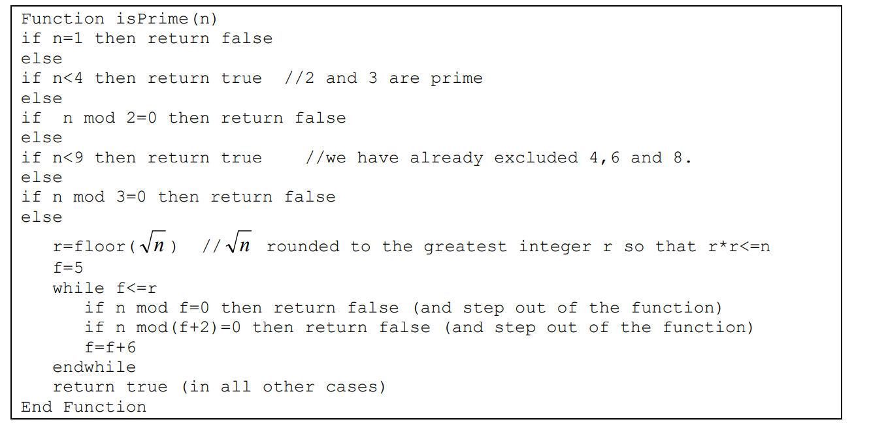

> 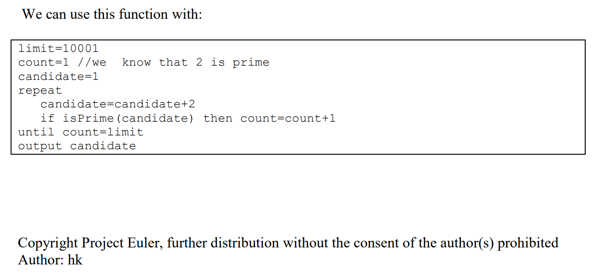

为什么除了2、3，素数都是可以写成 (6k±1)？

> [***Is every prime number other than 2 and 3 of the form (6k±1)? Is this a proven result? What are other resources about it?***](https://www.quora.com/Is-every-prime-number-other-than-2-and-3-of-the-form-6k%C2%B11-Is-this-a-proven-result-What-are-other-resources-about-it)
>
> 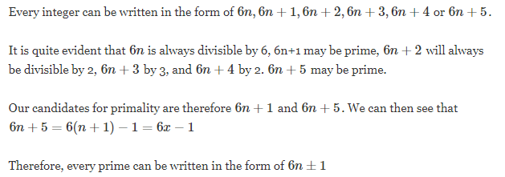

***素数试除法***

用来验证一个数是否为素数。

1. 对于一个数 N，首先可以判断 N 是否为偶数，也就是是否被 2 整除，如果是偶数，那么一定不是素数。

2. 只要 N 不能被 ceil($\sqrt n$) 前面的数所整除，也就是根号 n 上取整前面的数所整除，那么该数是素数，下面来证明此结论

   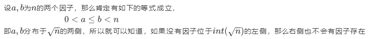

3. 所以需要首先判断是否是偶数，如果不是，从 3 开始，步长为 2 到 根号 n 上取整判断能否为 N 所整除即可，复杂度为 O($\sqrt n$)。

C++代码

```c++
#include<iostream>

int main()
{
    int N;
    std::cin>>N;
    int flag = 1;
    if(N%2==0)  flag = 0;
    if(N%3==0)  flag = 0;
    for(int i=5;i*i<N;i=i+6)
    {
        if(N%i==0)      {flag=0;break;}
        if(N%(i+2)==0)  {flag=0;break;}
    }
    if(flag == 1)
        std::cout<<N<<" is a Prime";
    else    
        std::cout<<N<<" is not a Prime";          
    return 0;
}
```

MATLAB 代码

```matlab
N = 27;
flag = 1;
i = 3;
if(mod(N,2)==0 && mod(N,2) == 0)
    flag = 0;
else
while(i^2 < N)
    if(mod(N,i)==0)
        flag = 0;
        break
    end
    i=i+6;
end
end
```

## [8.Largest product in a series](https://projecteuler.net/problem=8)

The four adjacent digits in the 1000-digit number that have the greatest product are 9 × 9 × 8 × 9 = 5832.

73167176531330624919225119674426574742355349194934
96983520312774506326239578318016984801869478851843
85861560789112949495459501737958331952853208805511
12540698747158523863050715693290963295227443043557
66896648950445244523161731856403098711121722383113
62229893423380308135336276614282806444486645238749
30358907296290491560440772390713810515859307960866
70172427121883998797908792274921901699720888093776
65727333001053367881220235421809751254540594752243
52584907711670556013604839586446706324415722155397
53697817977846174064955149290862569321978468622482
83972241375657056057490261407972968652414535100474
82166370484403199890008895243450658541227588666881
16427171479924442928230863465674813919123162824586
17866458359124566529476545682848912883142607690042
24219022671055626321111109370544217506941658960408
07198403850962455444362981230987879927244284909188
84580156166097919133875499200524063689912560717606
05886116467109405077541002256983155200055935729725
71636269561882670428252483600823257530420752963450

Find the thirteen adjacent digits in the 1000-digit number that have the greatest product. What is the value of this product?

在这 1000 个数中，具有最大乘积的的四个相邻数字是9×9×8×9 = 5832。

73167176531330624919225119674426574742355349194934
96983520312774506326239578318016984801869478851843
85861560789112949495459501737958331952853208805511
12540698747158523863050715693290963295227443043557
66896648950445244523161731856403098711121722383113
62229893423380308135336276614282806444486645238749
30358907296290491560440772390713810515859307960866
70172427121883998797908792274921901699720888093776
65727333001053367881220235421809751254540594752243
52584907711670556013604839586446706324415722155397
53697817977846174064955149290862569321978468622482
83972241375657056057490261407972968652414535100474
82166370484403199890008895243450658541227588666881
16427171479924442928230863465674813919123162824586
17866458359124566529476545682848912883142607690042
24219022671055626321111109370544217506941658960408
07198403850962455444362981230987879927244284909188
84580156166097919133875499200524063689912560717606
05886116467109405077541002256983155200055935729725
71636269561882670428252483600823257530420752963450

找到在 1000 位数字中具有最大乘积的  13 个相邻数字。 这个乘积是多少？

## [9.Special Pythagorean triplet](https://projecteuler.net/problem=9)

A Pythagorean triplet is a set of three natural numbers, a < b < c, for which,

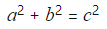

For example,

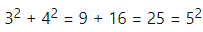

There exists exactly one Pythagorean triplet for which a + b + c = 1000.
Find the product *abc*.

找出和为 1000 的三个勾股数的乘积。

> [勾股数](https://zh.wikipedia.org/w/index.php?title=%E5%8B%BE%E8%82%A1%E6%95%B0&action=edit&section=0&summary=/%20top%20/%20)
>
> [](https://zh.wikipedia.org/wiki/File:Rtriangle.svg)
>
> **勾股数**，又名**商高数**或**毕氏数**（Pythagorean triple），是由三个[正整数](https://zh.wikipedia.org/wiki/%E6%AD%A3%E6%95%B4%E6%95%B0)组成的数组；能符合[勾股定理](https://zh.wikipedia.org/wiki/%E5%8B%BE%E8%82%A1%E5%AE%9A%E7%90%86)（毕式定理之中，的正整数解。而且，基于勾股定理的[逆定理](https://zh.wikipedia.org/wiki/%E5%AE%9A%E7%90%86)，任何[边长](https://zh.wikipedia.org/wiki/%E8%BE%B9%E9%95%BF)是勾股数组的[三角形](https://zh.wikipedia.org/wiki/%E4%B8%89%E8%A7%92%E5%BD%A2)都是[直角三角形](https://zh.wikipedia.org/wiki/%E7%9B%B4%E8%A7%92%E4%B8%89%E8%A7%92%E5%BD%A2)。
>
> 如果是勾股数，它们的正整数[倍数](https://zh.wikipedia.org/wiki/%E5%80%8D%E6%95%B8)，也是勾股数，即也是勾股数。若果三者[互质](https://zh.wikipedia.org/wiki/%E4%BA%92%E8%B3%AA)（它们的[最大公因数](https://zh.wikipedia.org/wiki/%E6%9C%80%E5%A4%A7%E5%85%AC%E5%9B%A0%E6%95%B8)是 1），它们就称为**素勾股数**。
>
> [**找出勾股数**](https://zh.wikipedia.org/w/index.php?title=%E5%8B%BE%E8%82%A1%E6%95%B0&action=edit&section=1)
>
> 以下的方法可用来找出勾股数。设、和均是正整数，
>
> 
>
> 
>
> 
>
> 若和是[互质](https://zh.wikipedia.org/wiki/%E4%BA%92%E8%B3%AA)，而且和为一奇一偶，计算出来的就是素勾股数。（若和都是[奇数](https://zh.wikipedia.org/wiki/%E5%A5%87%E6%95%B0)，就会全是[偶数](https://zh.wikipedia.org/wiki/%E5%81%B6%E6%95%B0)，不符合[互质](https://zh.wikipedia.org/wiki/%E4%BA%92%E8%B3%AA)。）
>
> 所有素勾股数可用上述列式当中找出，这亦可推论到数学上存在无穷多的素勾股数。
>
> [**例子**](https://zh.wikipedia.org/w/index.php?title=%E5%8B%BE%E8%82%A1%E6%95%B0&action=edit&section=2)
>
> 以下是小于 100 的素勾股数：
>
> |  |  |  |
> | :----------------------------------------------------------: | :----------------------------------------------------------: | :----------------------------------------------------------: |
> |                              3                               |                              4                               |                              5                               |
> |                              5                               |                              12                              |                              13                              |
> |                              7                               |                              24                              |                              25                              |
> |                              8                               |                              15                              |                              17                              |
> |                              9                               |                              40                              |                              41                              |
> |                              11                              |                              60                              |                              61                              |
> |                              12                              |                              35                              |                              37                              |
> |                              13                              |                              84                              |                              85                              |
> |                              16                              |                              63                              |                              65                              |
> |                              20                              |                              21                              |                              29                              |
> |                              28                              |                              45                              |                              53                              |
> |                              33                              |                              56                              |                              65                              |
> |                              36                              |                              77                              |                              85                              |
> |                              39                              |                              80                              |                              89                              |
> |                              48                              |                              55                              |                              73                              |
> |                              65                              |                              72                              |                              97                              |
>
> 让我们把上述列式重组至以下列式：
>
> 
>
> 有些勾股数组可以有同一个最小的勾股数。第一个例子是 20 ，它在以下两组勾股数之中出现：与。
>
> 其中最先例子是5，它在以下两组勾股数之中出现及。
>
> 在 15,386 组素勾股数的 1229779565176982820 ，它的最小与最大的勾股数组是：
>
> 
>
> 
>
> 
>
> 与
>
> 
>
> 
>
> 
>
> 试考虑它的素因数分解
>
> 
>
> 它素因数的个数涉及不少素勾股数。当然，数学上存在比它大的素勾股数。
>
> [性质](https://zh.wikipedia.org/w/index.php?title=%E5%8B%BE%E8%82%A1%E6%95%B0&action=edit&section=3)
>
> - 
> - 至少一个是3的倍数
> - 至少一个是4的倍数
> - 至少一个是5的倍数
>
> [找寻勾股数的小技巧](https://zh.wikipedia.org/w/index.php?title=%E5%8B%BE%E8%82%A1%E6%95%B0&action=edit&section=4)
>
> 若需要一组最小数为奇数的勾股数，可任意选取一个 3 或以上的[奇数](https://zh.wikipedia.org/wiki/%E5%A5%87%E6%95%B8)，将该数自乘为[平方数](https://zh.wikipedia.org/wiki/%E5%B9%B3%E6%96%B9%E6%95%B8)，除以 2，答案加减 0.5 可得到两个新的数字，这两个数字连同一开始选取的[奇数](https://zh.wikipedia.org/wiki/%E5%A5%87%E6%95%B8)，三者必定形成一组勾股数。但却不一定是以这个选取数字为起首勾股数的唯一可能，例如并非是以 27 为起首的唯一勾股数，因为存在另一个勾股数是，同样也以 27 为首。
>
> 对于任何大于1的整数，,与，三个数必为勾股数，例如：代入为2，则为5，为3，为4，为一组勾股数。
>
> [推广](https://zh.wikipedia.org/w/index.php?title=%E5%8B%BE%E8%82%A1%E6%95%B0&action=edit&section=5)
>
> [费马最后定理](https://zh.wikipedia.org/wiki/%E8%B4%B9%E9%A9%AC%E6%9C%80%E5%90%8E%E5%AE%9A%E7%90%86)指出，若，而是大于 2 的整数，即没有正整数解。

## [10.Summation of primes](https://projecteuler.net/problem=10)

The sum of the primes below 10 is  2 + 3 + 5 + 7 = 17.

Find the sum of all the primes below two million.

10 以下素数的和为 2+3+5+7 = 17。

找到 2,000,000 以下的所有素数和。

> [**埃拉托斯特尼筛法**](https://zh.wikipedia.org/wiki/%E5%9F%83%E6%8B%89%E6%89%98%E6%96%AF%E7%89%B9%E5%B0%BC%E7%AD%9B%E6%B3%95)
>
> [**步骤**](https://zh.wikipedia.org/w/index.php?title=%E5%9F%83%E6%8B%89%E6%89%98%E6%96%AF%E7%89%B9%E5%B0%BC%E7%AD%9B%E6%B3%95&action=edit&section=2)
>
> [](https://zh.wikipedia.org/wiki/File:Sieve_of_Eratosthenes_animation.gif)
>
> 详细列出算法如下：
>
> 1. 列出2以后的所有序列：
>    - 2 3 4 5 6 7 8 9 10 11 12 13 14 15 16 17 18 19 20 21 22 23 24 25
> 2. 标出序列中的第一个质数，也就是2，序列变成：
>    - 2 3 4 5 6 7 8 9 10 11 12 13 14 15 16 17 18 19 20 21 22 23 24 25
> 3. 将剩下序列中，划摽2的倍数（用红色标出），序列变成：
>    - 2 3 4 5 6 7 8 9 10 11 12 13 14 15 16 17 18 19 20 21 22 23 24 25
> 4. 如果现在这个序列中最大数小于等于最后一个标出的素数的平方，那么剩下的序列中所有的数都是质数，否则回到第二步。
>
> 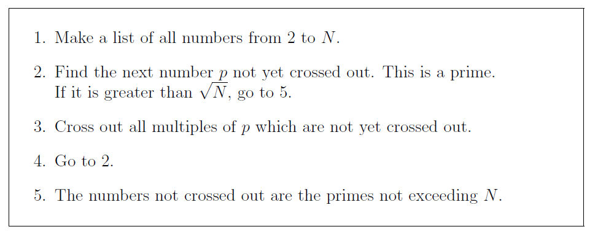
>
> ------
>
> 1. 本例中，因为25大于2的平方，我们返回第二步：
> 2. 剩下的序列中第一个质数是3，将主序列中3的倍数划出（红色），主序列变成：
>    - 2 3 4 5 6 7 8 9 10 11 12 13 14 15 16 17 18 19 20 21 22 23 24 25
>
> 1. 我们得到的质数有：2，3
> 2. 25仍然大于3的平方，所以我们还要返回第二步：
> 3. 现在序列中第一个质数是5，同样将序列中5的倍数划出，主序列成了：
>    - 2 3 4 5 6 7 8 9 10 11 12 13 14 15 16 17 18 19 20 21 22 23 24 25
> 4. 我们得到的质数有：2, 3, 5 。
> 5. 因为25等于5的平方，结束循环
>
> 结论：去掉红色的数字，2到25之间的质数是：2, 3, 5, 7, 11, 13, 17, 19, 23。
>
> **算法**
>
> 埃拉托斯特尼筛法，可以用以下的[伪代码](https://zh.wikipedia.org/wiki/%E4%BC%AA%E4%BB%A3%E7%A0%81)来表示：
>
> ```c
> Input: an integer n > 1
> 
> Let A be an array of Boolean values, indexed by integers 2 to n,
> initially all set to true.
> 
> for i = 2, 3, 4, ..., not exceeding 
> 
> 
> {\displaystyle {\sqrt {n}}}
> 
> :
> if A[i] is true:
> for j = i2, i2+i, i2+2i, i2+3i, ..., not exceeding n :
> A[j] := false
> 
> Output: all i such that A[i] is true.
> ```
>
> 以上算法可以得到小于等于*n*的所有[素数](https://zh.wikipedia.org/wiki/%E8%B3%AA%E6%95%B8)，它的复杂度是O(*n* log log *n*)。
>
> 所以，在大数目素数筛选的时候，采用这个算法的复杂第是很高的。

使用 MATLAB 只需要调用一个函数即可

```matlab
>> tic
sum(primes(2000000))
toc

ans =

   1.4291e+11

时间已过 0.017074 秒。
```

`primes` 函数：

```matlab
function p = primes(n)
%PRIMES Generate list of prime numbers.
%   PRIMES(N) is a row vector of the prime numbers less than or 
%   equal to N.  A prime number is one that has no factors other
%   than 1 and itself.
%
%   Class support for input N:
%      float: double, single
%      integer: uint8, int8, uint16, int16, uint32, int32, uint64, int64
%
%   See also FACTOR, ISPRIME.

%   Copyright 1984-2013 The MathWorks, Inc. 

if ~isscalar(n) 
  error(message('MATLAB:primes:InputNotScalar'));
elseif ~isreal(n)
  error(message('MATLAB:primes:ComplexInput'));
end
if n < 2
  p = zeros(1,0,class(n)); 
  return
elseif isfloat(n) && n > flintmax(class(n))
  warning(message('MATLAB:primes:NGreaterThanFlintmax'));
  n = flintmax(class(n));  
end
n = floor(n);
p = true(1,double(ceil(n/2)));
q = length(p);
if (isa(n,'uint64') || isa(n,'int64')) && n > flintmax
  ub = 2.^(nextpow2(n)/2);  %avoid casting large (u)int64 to double
else
  ub = sqrt(double(n));
end
for k = 3:2:ub
  if p((k+1)/2)
     p(((k*k+1)/2):k:q) = false;
  end
end
p = cast(find(p)*2-1,class(n));
p(1) = 2;
```

在上述程序中：

- `P = nextpow2(A)` 返回对 A 中每个元素满足
  2*^p^*≥|A|

- B = cast(A,newclass) 将 A 转换为类 newclass，其中 newclass 是与 A 兼容的内置数据类型的名称。cast 函数截断 A 中太大而无法映射到 newclass 的任何值。
  B = cast(A,'like',p) 将 A 转换为与变量 p 相同的数据类型和稀疏性。如果 A 和 p 都为实数，则 B 也为实数。否则，B 为复数。
- 算法核心部分是：

```matlab
for k = 3:2:ub
  if p((k+1)/2)
     p(((k*k+1)/2):k:q) = false;
  end
end
p = cast(find(p)*2-1,class(n));
```

> [**测试素数与整数分解**](https://zh.wikipedia.org/wiki/%E7%B4%A0%E6%95%B0)
>
> ------
>
> 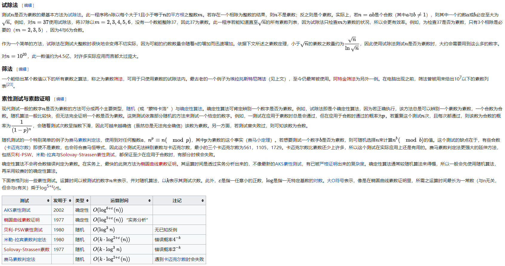

***素数求和***

> 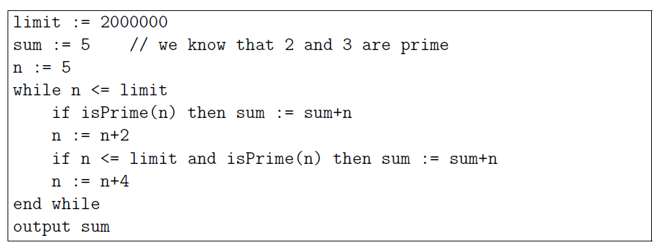

简单的素数求和

***A first implementation of The sieve of Eratosthenes***

> 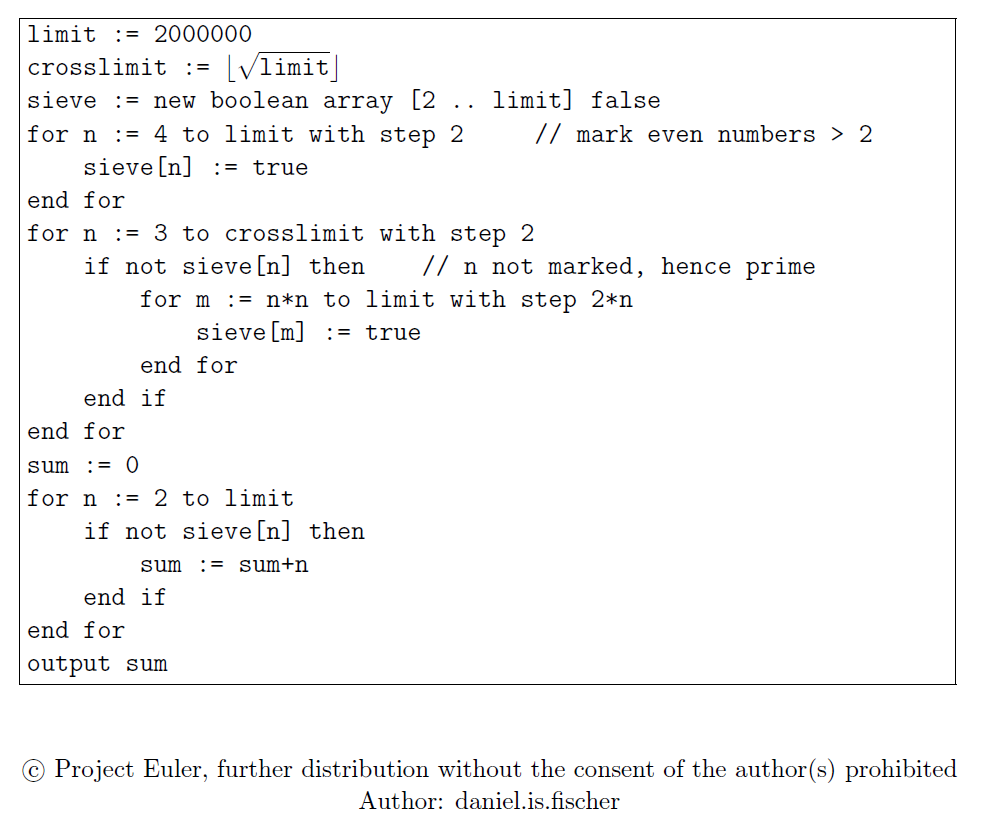

对于埃拉托斯妮特素数筛选法的第一次实现：

1. 限定要得到素数的范围 `limit`，确定 `limit` 的最大的素数因子的最大范围 `crosslimit`
2. 建立一个数组 `sieve`用来存储是否该数被筛去，初始都为被筛去，赋值 `false`
3. 初步划分奇偶数，因为偶数一定不是素数，所以可以直接筛去
4. 对于从 3 开始的每个数 p 用作因子进行筛选，步长为 `2p`（原因：因为因子 `2` 已经被筛去，所以如果 `p` 非一个数的因子，那么 `p+p=2p` 肯定也不会是一个数的因子），筛选起始点为 p^2^ （原因：如果有一个数小于 p^2^设为`kp`，则 `k < p` ，则在 k 的时候就已经被筛选过了，所以只需要从 p^2^开始筛选即可），这也就是两个循环的由来，筛选的数的中点也就是有一个数一开始筛选就到了 `limit`，即 `p == crosslimit` 的时候
5. 对于未筛去的数求和，依靠判别向量

***Optimising the sieve***

> 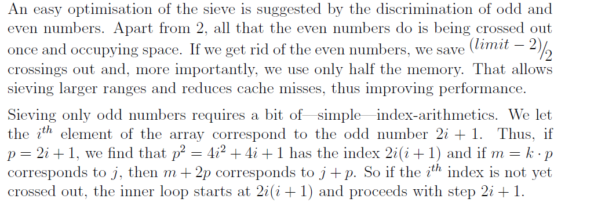
>
> 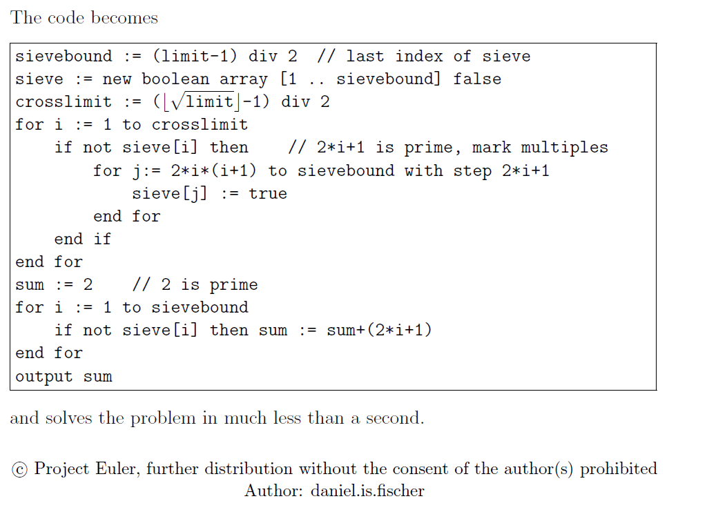

对于埃托尼斯尼特筛选的优化：

因为偶数（除了2）不可能是素数，所以可以在构造数组的时候就直接删去，只存储奇数进行筛选，这样的话内存可以优化一半。

1. 确定存储向量的长度 `sievebound` 为 `(limit-1)/2`，因为筛去偶数和 1
2. `sieve`数组还是存储筛去与否的信息，原始是都不筛去，为 `false`
3. `corsslimit` 的取值其实为 $\sqrt {(limit-1)/2}=\sqrt{limit-1}/2=(\lfloor limit \rfloor-1)/2$
4. 每个下标 `i` 对应的存储的奇数为 `2n+1`（n 从 0 开始取），所以 筛选的因子范围是 1~`crosslimit`，每个素因子对于后面的数的判断应该是从 `i`下标所代表的数的平方开始的，`i`下标所代表的数是 `2i+1`，那么这个数的平方是 `4i^2+4i+1`，这个大小的数所代表的下标是 `4i^2+4i=2i(i+1)`，所以对每一个素数因子来说都从 `j=2i(i+1)`开始进行筛，步长为 `((2*i*(i+1)*2/2i)-1`（因为每次要增加 `2p`，p=2i(i+1)，那么 2p=4i(i+1)，这个数对应的下标为 4i(i+1)/2i -1=<u>2i+1</u>)，所以步长为 `2i+1`
5. 最后累加素数

## [11.Largest product in a grid](https://projecteuler.net/problem=11)

In the 20×20 grid below, four numbers along a diagonal line have been marked in red.

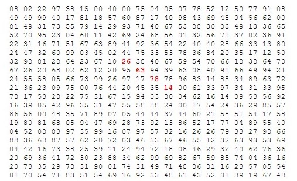

The product of these numbers is 26 × 63 × 78 × 14 = 1788696.

What is the greatest product of four adjacent numbers in the same direction (up, down, left, right, or diagonally) in the 20×20 grid?

在 20×20 的格子中，四个对角线的数字被标红

这四个数的乘积是 26 × 63 × 78 × 14 = 1788696.

在 20×20 网格中同方向的四个相邻数的最大乘积是多少（上，下，左，右或者对角线）？

## [12Highly divisible triangular number.](https://projecteuler.net/problem=12)

The sequence of triangle numbers is generated by adding the natural numbers. So the 7th triangle number would be 1 + 2 + 3 + 4 + 5 + 6 + 7 = 28. The first ten terms would be:

1, 3, 6, 10, 15, 21, 28, 36, 45, 55, ...

Let us list the factors of the first seven triangle numbers:

 **1**: 1
 **3**: 1,3
 **6**: 1,2,3,6
**10**: 1,2,5,10
**15**: 1,3,5,15
**21**: 1,3,7,21
**28**: 1,2,4,7,14,28

We can see that 28 is the first triangle number to have over five divisors.

What is the value of the first triangle number to have over five hundred divisors?

第 n 个三角形数序列是前 n 个自然数之和。比如，第 7 个三角形数是 1+2+3+4+5+6+7=28，三角形数的前十个数为 1，3，6，10，15，21，28，36，45，55，...

让我们来看一下这些数字的因子有哪些

| 第 n 个数 | 第 n 个数的因子    |
| --------- | ------------------ |
| 1         | 1                  |
| 3         | 1，3               |
| 6         | 1，2，3，6         |
| 10        | 1，2，5，10        |
| 15        | 1，3，5，15        |
| 21        | 1，3，7，21        |
| 28        | 1，2，4，7，14，28 |

我们可以看到 28 是第一个有 5 个因子的三角形数

求第一个有 500 个因子的三角形数是多少？

> ***维基百科***
>
> 一定数目的点或圆在等距离的排列下可以形成一个等边三角形，这样的数被称为**三角形数**。比如10个点可以组成一个等边三角形，因此10是一个三角形数：
>
> 一开始的18个三角形数是[1](https://zh.wikipedia.org/wiki/1)、[3](https://zh.wikipedia.org/wiki/3)、[6](https://zh.wikipedia.org/wiki/6)、[10](https://zh.wikipedia.org/wiki/10)、[15](https://zh.wikipedia.org/wiki/15)、[21](https://zh.wikipedia.org/wiki/21)、[28](https://zh.wikipedia.org/wiki/28)、[36](https://zh.wikipedia.org/wiki/36)、[45](https://zh.wikipedia.org/wiki/45)、[55](https://zh.wikipedia.org/wiki/55)、[66](https://zh.wikipedia.org/wiki/66)、[78](https://zh.wikipedia.org/wiki/78)、[91](https://zh.wikipedia.org/wiki/91)、105、120、136、153、171、190、210、231、253……
>
> 一个三角数乘以九再加一仍是一个三角数。
>
> 三角数的个位数字不可能是2、4、7、9，[数字根](https://zh.wikipedia.org/wiki/%E6%95%B8%E5%AD%97%E6%A0%B9)不可能是2、4、5、7、8。
>
> 三角数的二倍的平方根取整，是这个三角数的序数。
>
> 
>
> ## 性质[[编辑](https://zh.wikipedia.org/w/index.php?title=%E4%B8%89%E8%A7%92%E5%BD%A2%E6%95%B8&action=edit&section=1)]
>
> - 第n个三角形数的公式是。
>
> - 第n个三角形数是从1开始的n个[自然数的和](https://zh.wikipedia.org/wiki/1_%2B_2_%2B_3_%2B_4_%2B_%E2%80%A6)。
>
> - 所有大于3的三角形数都不是[质数](https://zh.wikipedia.org/wiki/%E8%B4%A8%E6%95%B0)。
>
> - 开始的n个[立方数](https://zh.wikipedia.org/wiki/%E7%AB%8B%E6%96%B9%E6%95%B0)的和是第n个三角形数的[平方](https://zh.wikipedia.org/wiki/%E5%B9%B3%E6%96%B9)（举例：1 + 8 + 27 + 64 = 100 = 102）
>
> - 所有三角形数的[倒数](https://zh.wikipedia.org/wiki/%E5%80%92%E6%95%B0)之和是[2](https://zh.wikipedia.org/wiki/2)。
>
> - 任何三角形数乘以[8](https://zh.wikipedia.org/wiki/8)再加[1](https://zh.wikipedia.org/wiki/1)是一个[平方数](https://zh.wikipedia.org/wiki/%E5%B9%B3%E6%96%B9%E6%95%B0)。
>
> - 一部分三角形数（3、10、21、36、55、78……）可以用以下这个[公式](https://zh.wikipedia.org/wiki/%E5%85%AC%E5%BC%8F)来表示：；而剩下的另一部分（1、6、15、28、45、66……）则可以用来表示。
>
> - 一种[检验](https://zh.wikipedia.org/w/index.php?title=%E6%A3%80%E9%AA%8C&action=edit&redlink=1)[正整数](https://zh.wikipedia.org/wiki/%E6%AD%A3%E6%95%B4%E6%95%B0)*x*是否三角形数的方法，是[计算](https://zh.wikipedia.org/wiki/%E8%AE%A1%E7%AE%97)：
>
>   
>
>   如果*n*是[整数](https://zh.wikipedia.org/wiki/%E6%95%B4%E6%95%B0)，那么*x*就是第*n*个**三角形数**。如果*n*不是[整数](https://zh.wikipedia.org/wiki/%E6%95%B4%E6%95%B0)，那么*x*不是三角形数。这个检验法是基于[恒等式](https://zh.wikipedia.org/wiki/%E6%81%92%E7%AD%89%E5%BC%8F)
>

## [13Large sum.](https://projecteuler.net/problem=13)

Work out the first ten digits of the sum of the following one-hundred 50-digit numbers.

37107287533902102798797998220837590246510135740250
46376937677490009712648124896970078050417018260538
74324986199524741059474233309513058123726617309629
91942213363574161572522430563301811072406154908250
23067588207539346171171980310421047513778063246676
89261670696623633820136378418383684178734361726757
28112879812849979408065481931592621691275889832738
44274228917432520321923589422876796487670272189318
47451445736001306439091167216856844588711603153276
70386486105843025439939619828917593665686757934951
62176457141856560629502157223196586755079324193331
64906352462741904929101432445813822663347944758178
92575867718337217661963751590579239728245598838407
58203565325359399008402633568948830189458628227828
80181199384826282014278194139940567587151170094390
35398664372827112653829987240784473053190104293586
86515506006295864861532075273371959191420517255829
71693888707715466499115593487603532921714970056938
54370070576826684624621495650076471787294438377604
53282654108756828443191190634694037855217779295145
36123272525000296071075082563815656710885258350721
45876576172410976447339110607218265236877223636045
17423706905851860660448207621209813287860733969412
81142660418086830619328460811191061556940512689692
51934325451728388641918047049293215058642563049483
62467221648435076201727918039944693004732956340691
15732444386908125794514089057706229429197107928209
55037687525678773091862540744969844508330393682126
18336384825330154686196124348767681297534375946515
80386287592878490201521685554828717201219257766954
78182833757993103614740356856449095527097864797581
16726320100436897842553539920931837441497806860984
48403098129077791799088218795327364475675590848030
87086987551392711854517078544161852424320693150332
59959406895756536782107074926966537676326235447210
69793950679652694742597709739166693763042633987085
41052684708299085211399427365734116182760315001271
65378607361501080857009149939512557028198746004375
35829035317434717326932123578154982629742552737307
94953759765105305946966067683156574377167401875275
88902802571733229619176668713819931811048770190271
25267680276078003013678680992525463401061632866526
36270218540497705585629946580636237993140746255962
24074486908231174977792365466257246923322810917141
91430288197103288597806669760892938638285025333403
34413065578016127815921815005561868836468420090470
23053081172816430487623791969842487255036638784583
11487696932154902810424020138335124462181441773470
63783299490636259666498587618221225225512486764533
67720186971698544312419572409913959008952310058822
95548255300263520781532296796249481641953868218774
76085327132285723110424803456124867697064507995236
37774242535411291684276865538926205024910326572967
23701913275725675285653248258265463092207058596522
29798860272258331913126375147341994889534765745501
18495701454879288984856827726077713721403798879715
38298203783031473527721580348144513491373226651381
34829543829199918180278916522431027392251122869539
40957953066405232632538044100059654939159879593635
29746152185502371307642255121183693803580388584903
41698116222072977186158236678424689157993532961922
62467957194401269043877107275048102390895523597457
23189706772547915061505504953922979530901129967519
86188088225875314529584099251203829009407770775672
11306739708304724483816533873502340845647058077308
82959174767140363198008187129011875491310547126581
97623331044818386269515456334926366572897563400500
42846280183517070527831839425882145521227251250327
55121603546981200581762165212827652751691296897789
32238195734329339946437501907836945765883352399886
75506164965184775180738168837861091527357929701337
62177842752192623401942399639168044983993173312731
32924185707147349566916674687634660915035914677504
99518671430235219628894890102423325116913619626622
73267460800591547471830798392868535206946944540724
76841822524674417161514036427982273348055556214818
97142617910342598647204516893989422179826088076852
87783646182799346313767754307809363333018982642090
10848802521674670883215120185883543223812876952786
71329612474782464538636993009049310363619763878039
62184073572399794223406235393808339651327408011116
66627891981488087797941876876144230030984490851411
60661826293682836764744779239180335110989069790714
85786944089552990653640447425576083659976645795096
66024396409905389607120198219976047599490197230297
64913982680032973156037120041377903785566085089252
16730939319872750275468906903707539413042652315011
94809377245048795150954100921645863754710598436791
78639167021187492431995700641917969777599028300699
15368713711936614952811305876380278410754449733078
40789923115535562561142322423255033685442488917353
44889911501440648020369068063960672322193204149535
41503128880339536053299340368006977710650566631954
81234880673210146739058568557934581403627822703280
82616570773948327592232845941706525094512325230608
22918802058777319719839450180888072429661980811197
77158542502016545090413245809786882778948721859617
72107838435069186155435662884062257473692284509516
20849603980134001723930671666823555245252804609722
53503534226472524250874054075591789781264330331690

计算出以上一百个 50 位数字之和的前十位数。

## [14.Longest Collatz sequence](https://projecteuler.net/problem=14)

The following iterative sequence is defined for the set of positive integers:

n → n/2 (n is even)
n → 3n + 1 (n is odd)

Using the rule above and starting with 13, we generate the following sequence:

13 → 40 → 20 → 10 → 5 → 16 → 8 → 4 → 2 → 1

It can be seen that this sequence (starting at 13 and finishing at 1) contains 10 terms. Although it has not been proved yet (Collatz Problem), it is thought that all starting numbers finish at 1.

Which starting number, under one million, produces the longest chain?

**NOTE:** Once the chain starts the terms are allowed to go above one million.

考拉兹猜想如下：

n → n/2 (n 是偶数)
n → 3n + 1 (n 奇数)

用 13 作为起始点举例，我们可以产生如下的序列：

13 → 40 → 20 → 10 → 5 → 16 → 8 → 4 → 2 → 1

这个序列包含 10 个数（起点 13，终点 1），虽然尚未被证明，但是目前大家都认为中点会是 1。

求在 1000000 以下的所有数中有最长的考拉兹序列的数

注意：这个链中的数可以大于 1000000

## [15.Lattice paths](https://projecteuler.net/problem=15)

Starting in the top left corner of a 2×2 grid, and only being able to move to the right and down, there are exactly 6 routes to the bottom right corner.


How many such routes are there through a 20×20 grid?

如图，2×2 的格子中，从左上顶点到右下顶点的路径数目为 6，那么 20×20 格子中从左上到右下的路径有几条？

## [16.Power digit sum](https://projecteuler.net/problem=16)

2^15^ = 32768 and the sum of its digits is 3 + 2 + 7 + 6 + 8 = 26.

What is the sum of the digits of the number 2^1000^?

2^15^ = 32768，32768 的各个位的和为 3+2+7+6+8=26

那么 2^1000^ 的各个位之和为多少？

## [17.Number letter counts](https://projecteuler.net/problem=17)

If the numbers 1 to 5 are written out in words: one, two, three, four, five, then there are 3 + 3 + 5 + 4 + 4 = 19 letters used in total.

If all the numbers from 1 to 1000 (one thousand) inclusive were written out in words, how many letters would be used?

**NOTE:** Do not count spaces or hyphens. For example, 342 (three hundred and forty-two) contains 23 letters and 115 (one hundred and fifteen) contains 20 letters. The use of "and" when writing out numbers is in compliance with British usage.

如果我们把 1~5 这5个数字的英文写下来，one, two, three, four, five，统计出现的字符总数，我们用了 3 + 3 + 5 + 4 + 4 = 19 个字符。

如果从 1~1000（one thousand）个数字的英文字符被写在纸上，那么我们可以统计出多少个字符。

注意：不要将空格和横杠统计进去，如 342（three hundred and forty-two) 包括 23 个字符，115 (one hundred and fifteen) 包含 20 个字符，在写数字时候使用符合英国用法的 `and`。

## [18.Maximum path sum I](https://projecteuler.net/problem=18)

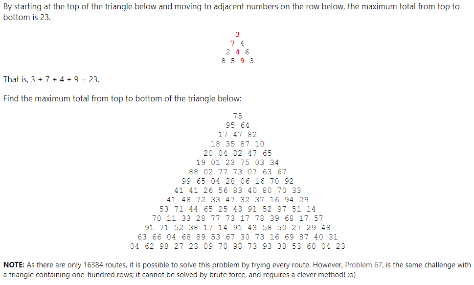

通过从顶点开始计算三角形的相邻数的路径，找到最大的和的路径为 23，即3+7+4+9

找到上图 2 的路径最大的和

注意：这里仅仅有 16384 条路径，所以遍历是可能的，但是在问题 67 中的三角形有 100 行，所以你最好使用更优雅的方法来解决这个问题。